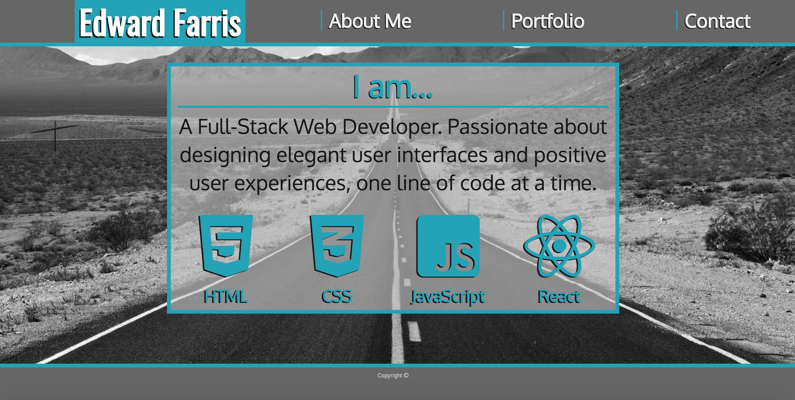

# EdwardFarris
Link to page: https://edwardfarris.github.io/EdwardFarris/

### **Description:**
This is the updated version of my professional portfolio. It contains a description of myself, including my background, strengths and technical skills. There is a separate page that displays recent projects, each actively linked so they may be explored individually. There is also a contact page containing the links for my gitHub and LinkedIn pages, as well as my  gmail address.  
_____
### **Demo Screenshot**

_________
### **Technologies Used**
* HTML5
* CSS3
* Bootstrap
* Google Fonts
* FontAwesome 
_____
### **Built With**
* Visual Studio Code